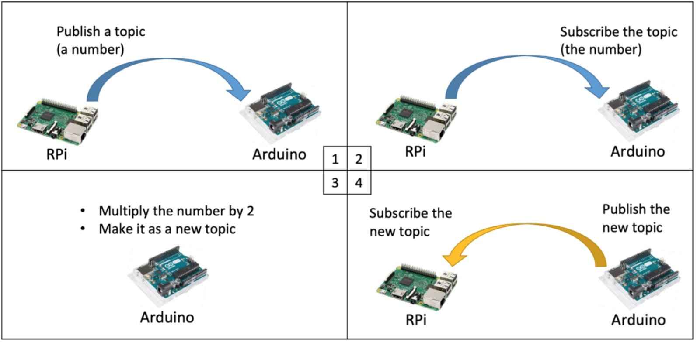
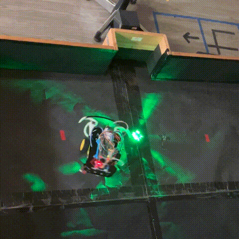

# Mobile Robots
### Teacher: Kai-Tai Song
This repo contains the checkpoint code in the 2022 mobile-robots course.
For the detail of each checkpoint please refer to its report.

## Checkpoint01
>Install the ROS platform on raspberry pi and set up the environment for robotics,
including the connection with Arduino board.

>Write project to publish an integer to Arduino from raspberry pi then receive the
double of the number by the platform set up previously. As shown in the following
figure.(The figure credits to TA’s slide.)

---

## Checkpoint02
>Assembly the mobile robot and control by ROS through raspberry pi and
Arduino.

>Control the DC motors by encoder signal to make the robot moving in different
direction. In the moving forward task, it is required to make the robot walk as
straight as possible.

-Result:

9 mm offset after moving 3 m forward.

---

## Checkpoint03
>Configure the touch sensor for mobile robot to react when hitting the obstacle
or the wall.

>Configure the light sensor for mobile to detect the LED light object.

>The mobile robot should find the LED light object automatically while
avoiding the object in the arena.

-Result:

The task was finished in 17.36 seconds.

---

## Checkpoint04
>Configure the IR sensor for mobile robot to find the door after catching the
light ball.

>The mobile robot should find the LED light object automatically and take the
light ball to the door while avoiding the object in the arena.

-Result:

The task was finished in 18.36 seconds.

---

## Final

>It's around the corner...

